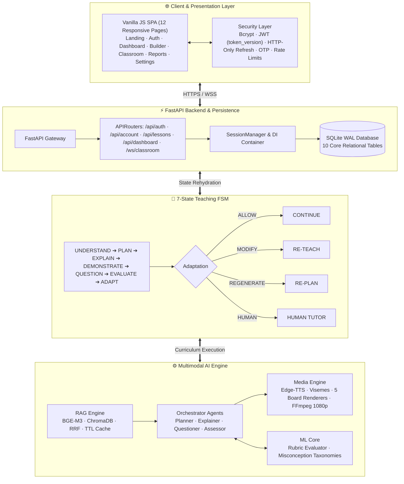

<div align="center">

# 🎓 Shikshak AI (शिक्षक AI)

### *Autonomous, Multimodal AI Educator with Real-Time Pedagogical Adaptation & Viseme Lip-Synced Video Instruction*

<br/>

[](https://www.python.org/)
[](https://fastapi.tiangolo.com/)
[](https://sqlite.org/wal.html)
[](https://huggingface.co/BAAI/bge-m3)
[](https://www.trychroma.com/)
[](https://deepmind.google/technologies/gemini/)
[](https://ffmpeg.org/)
[](https://opensource.org/licenses/MIT)

<br/>

[](https://respondent-dropped-him-volt.trycloudflare.com)
[](https://drive.google.com/drive/folders/1ibsr1tZanhtruCBbIwiGkAy0mXx35XLY?usp=drive_link)

<br/>

> **AI Innovation Hackathon 2026 (Round 2)** · *AI Teacher Track*

</div>

---

## 📋 Table of Contents

- [🧭 Overview](#-overview)
- [🚀 Live Demo & Resources](#-live-demo--resources)
- [🏗️ Architecture & Visuals](#️-architecture--visuals)
- [🧩 Key Pedagogical Features](#-key-pedagogical-features)
- [🛡️ Anti-Cheating & Security](#️-anti-cheating--security)
- [💻 Installation & Running Locally](#-installation--running-locally)
- [🎛️ Configuration](#️-configuration)
- [🗄️ Database Architecture (SQLite WAL)](#️-database-architecture-sqlite-wal)
- [📁 Project Structure](#-project-structure)
- [🧪 Testing](#-testing)

---

## 🧭 Overview

**Shikshak AI (शिक्षक AI)** transforms dry textbooks, dense syllabus documents, and unstructured lecture notes into **interactive, conversational, multimodal video lessons** that intelligently adapt whenever a student struggles.

Unlike generic LLM wrappers that generate passive walls of text, Shikshak AI functions as an autonomous master educator:

- 🧠 **Multimodal Grounding (RAG)**: Ingests PDF, DOCX, PPTX, and text across English, Hindi, and Bengali using BGE-M3 hybrid retrieval with cross-encoder reranking.
- ⚙️ **Cognitive Curriculum Planning**: Sequences concepts pedagogically (`Intro` → `Core` → `Advanced`) matched to the learner’s explicit time budget.
- 🎬 **Autonomous Multimodal Video Instruction**: Narrates every concept segment with neural TTS, 24 FPS lip-synced visemes, and dynamically rendered visual boards (LaTeX, Matplotlib, Graphviz, Pygments) composited to 1080p video via FFmpeg.
- 🎯 **Real-Time Pedagogical Adaptation**: Dynamically evaluates student answers against rubrics and branches via a **7-State Teaching FSM**. 

> **Moving automated education from static generation into provable, pedagogical adaptation.**

---

## 🚀 Live Demo & Resources

<div align="center">

| Resource | Link |
|:--------:|:----:|
| 🌐 **Live Web Platform** | **[Launch Shikshak AI](https://respondent-dropped-him-volt.trycloudflare.com)** |
| 🎬 **Demo Video Walkthrough** | **[Watch on Google Drive](https://drive.google.com/drive/folders/1ibsr1tZanhtruCBbIwiGkAy0mXx35XLY?usp=drive_link)** |
| 📦 **GitHub Repository** | **[Sagnik120/Shikshak_AI](https://github.com/Sagnik120/Shikshak_AI)** |

</div>

> [!TIP]
> No deployment? See [Installation & Running Locally](#-installation--running-locally) to run the full platform locally via Docker or Python in under 5 minutes.

---

## 🏗️ Architecture & Visuals

<div align="center">

*Figure 1 — Full End-to-End System Architecture*



> 📄 **See Blueprints**: [`docs/full_system_architecture_diagram_prompt.md`](docs/full_system_architecture_diagram_prompt.md) and [`docs/internal_ai_agents_architecture_diagram_prompt.md`](docs/internal_ai_agents_architecture_diagram_prompt.md)

</div>

---

## 🧩 Key Pedagogical Features

All core functionalities are built as highly modular subsystems across the platform:

### 🧠 7-State Teaching FSM
- **Explicit finite state machine**: `UNDERSTAND` → `PLAN` → `EXPLAIN` → `DEMONSTRATE` → `QUESTION` → `EVALUATE` → `ADAPT` → `CONTINUE` → `DONE`.
- **4-Branch Adaptive Loop**: Non-linear curriculum execution with `ALLOW`, `MODIFY`, `REGENERATE`, and `HUMAN` escalation transitions.

### 🎬 Viseme Lip-Sync Alignment
- **24 FPS facial phoneme/viseme timing** synchronized directly with Edge-TTS audio boundaries and WebVTT subtitles.
- **5 Dynamic Visual Board Renderers**: Synthesizes math equations (LaTeX), mathematical graphs (Matplotlib), architecture diagrams (Graphviz), syntax-highlighted code (Pygments), and bullet takeaways.

### 📚 Hybrid Dense + Sparse RAG
- **BGE-M3 Embeddings** combining 1024-dimensional dense vectors with SPLADE lexical weights.
- **Reciprocal Rank Fusion (RRF)** combines lexical and dense scores; cross-encoders rank final top-k context passages.
- **Thread-safe 5-minute TTL memory cache** prevents redundant retrieval calls.

### 📊 Student Analytics Dashboard
- Real-time learning velocity, daily streak tracking, active session resume, mastery plots, and misconception distributions.

---

## 🛡️ Anti-Cheating & Security

- **🚫 Dynamic Rubric Grading**: Questions demand original conceptual reasoning. Answers are graded by ML Core against multi-criterion rubrics rather than strict string matching, eliminating direct textbook copy-pasting.
- **⏭️ Non-Skippable Concept Flow**: Students cannot skip forward through video checkpoints; state transitions only advance when the checkpoint evaluation criteria are met.
- **💾 Durable Session State**: The teaching FSM state is continuously backed by SQLite WAL mode. If a student closes their browser tab or loses power mid-lesson, the active session re-hydrates exactly at the current node.
- **🔐 Password Security**: Bcrypt (work factor 12) applied over a SHA-256 pre-hash to avoid 72-byte truncation vulnerabilities.
- **🔑 Session Management**: Short-lived JWT access tokens containing a `token_version` claim. Password updates bump `token_version` to invalidate all active tokens instantly.
- **🔄 Rotating Refresh Tokens**: High-entropy, HTTP-only refresh tokens stored as keyed SHA-256 digests in SQLite. Token reuse detection immediately revokes all family sessions.

---

## 💻 Installation & Running Locally

### Prerequisites (All Platforms)
- **Python 3.10+** (Python 3.11 recommended)
- **Git**
- **FFmpeg** (Recommended: installed on system `PATH`)

### 🍏 macOS / 🐧 Linux
```bash
# 1. Clone the repository
git clone https://github.com/Sagnik120/Shikshak_AI.git
cd Shikshak_AI

# 2. Create and activate virtual environment
python3 -m venv .venv
source .venv/bin/activate

# 3. Upgrade pip and install dependencies
pip install --upgrade pip
pip install -r requirements.txt

# 4. Configure environment variables
cp .env.example .env

# 5. Start Shikshak AI Server
python scripts/run_server.py
```

### 🪟 Windows (PowerShell)
```powershell
# 1. Clone repository
git clone https://github.com/Sagnik120/Shikshak_AI.git
cd Shikshak_AI

# 2. Create and activate virtual environment
python -m venv .venv
.\.venv\Scripts\Activate.ps1

# 3. Install dependencies
python -m pip install --upgrade pip
pip install -r requirements.txt

# 4. Create .env file & Start
Copy-Item .env.example .env
python scripts\run_server.py
```

### 🐳 Docker Compose (Cross-Platform)
Deploy the entire platform inside isolated, multi-stage containers:
```bash
cp .env.example .env
docker compose up --build -d
docker compose logs -f
```

---

## 🎛️ Configuration

Copy `.env.example` to `.env` to customize settings:

| Variable | Default / Example | Purpose & Notes |
| :--- | :--- | :--- |
| `ENVIRONMENT` | `development` | Switch to `production` for strict security, CORS, and cookie flags. |
| `HOST` / `PORT` | `0.0.0.0` / `8000` | Binding host address and port. |
| `SECRET_KEY` | *(auto-generated)* | Key for signing JWT tokens. Auto-generated to `data/.secret_key` if blank. |
| `GEMINI_API_KEY` | `""` | Live Gemini API key. System falls back gracefully to offline mode if unset. |
| `DATABASE_URL` | `sqlite:///data/shikshak.db` | SQLite database URI in WAL mode. |
| `SMTP_USER` / `PASS`| `""` / `""` | SMTP credentials. When blank, OTPs are returned in the UI as `dev_otp`. |
| `EMAIL_DEV_FALLBACK` | `true` | When `true`, dev OTPs are displayed in responses for offline demos. |
| `TRUST_PROXY_HEADERS` | `false` | Enable behind reverse proxies (Nginx, Cloudflare) to read real client IPs. |

---

## 🗄️ Database Architecture (SQLite WAL)

Shikshak AI utilizes SQLite in high-concurrency **Write-Ahead Logging (WAL)** mode with 10 production schemas:

```text
┌─────────────────┬────────────────────────────────────────────────────────────────────────┐
│ Table           │ Description & Stored Data                                              │
├─────────────────┼────────────────────────────────────────────────────────────────────────┤
│ users           │ User identity, bcrypt credentials, token_version, learning preferences │
│ otp_codes       │ Hashed, single-use, expiring verification and password reset codes     │
│ refresh_tokens  │ Rotating session tokens, IP address, user-agent, revoked family state  │
│ documents       │ Ingested PDF/DOCX/PPTX records, parsed chapter hierarchies, key terms  │
│ lessons         │ Lesson sessions, active FSM state, target duration, completion ratio   │
│ lesson_nodes    │ Per-concept mastery status, retry counts, script, rendered video URI   │
│ interactions    │ Turn-by-turn checkpoint questions, student responses, rubric grades    │
│ reports         │ Final assessment scores, strengths, weaknesses, narrative report       │
│ lesson_events   │ Append-only chronological audit log of all state machine events        │
│ learner_profiles│ Longitudinal learner mastery, streak counters, misconception tallies   │
└─────────────────┴────────────────────────────────────────────────────────────────────────┘
```

---

## 📁 Project Structure

```text
Shikshak_AI/
├── docs/                                  # Architectural blueprints & specifications
├── modules/
│   ├── backend/src/                       # FastAPI application & SQLite WAL persistence
│   ├── frontend/src/                      # Static SPA: HTML, CSS, JavaScript pages
│   ├── rag/src/                           # BGE-M3 hybrid retrieval, ChromaDB, RRF
│   ├── ai_agent_orchestration/src/        # 7-State FSM, 5 AI agents, Gemini adapter
│   ├── ml_core/src/                       # Rubric grading, misconception taxonomies
│   ├── avatar_voice/src/                  # Neural TTS, visemes, 5 renderers, FFmpeg
│   └── mlops/src/                         # PerfTrace latency telemetry & benchmarks
├── scripts/
│   ├── run_server.py                      # Production & dev server launch script
│   └── preflight_check.py                 # System health and diagnostic validator
├── Dockerfile                             # Container build configuration
└── docker-compose.yml                     # Multi-service container orchestrator
```

---

## 🧪 Testing

Run the comprehensive test suite across all subsystems:

```bash
# Run Backend security, auth, and lesson lifecycle tests (97 tests)
pytest modules/backend/tests -v

# Run RAG evaluation and grounding tests
pytest modules/rag/tests/eval -v

# Run full test harness
pytest modules/ tests/ -q
```

---

<div align="center">
  <b>Built with ❤️ for the AI Innovation Hackathon 2026</b><br/>
  <i>Empowering learners through autonomous, adaptive, multimodal AI education.</i>
</div>
