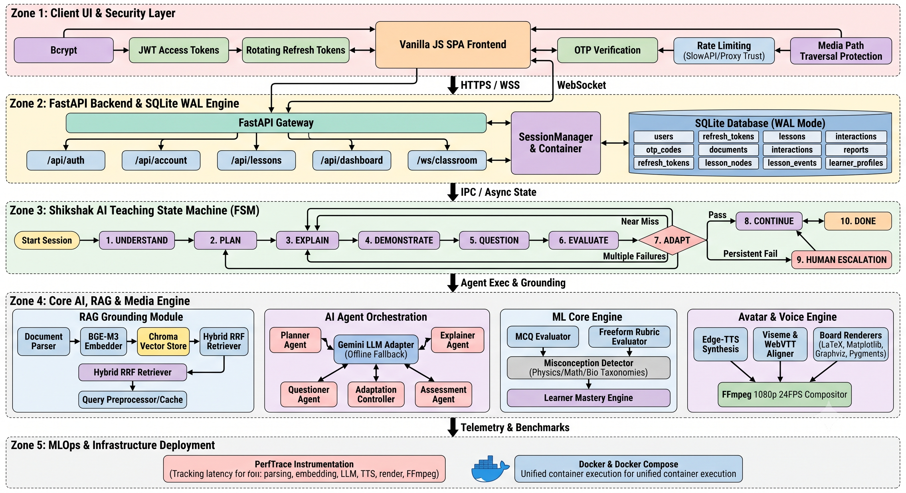
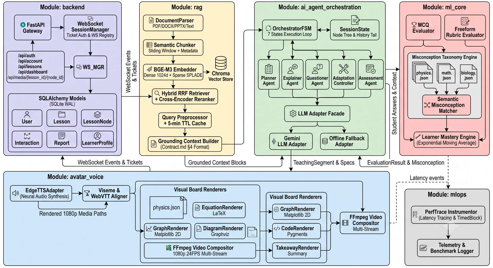
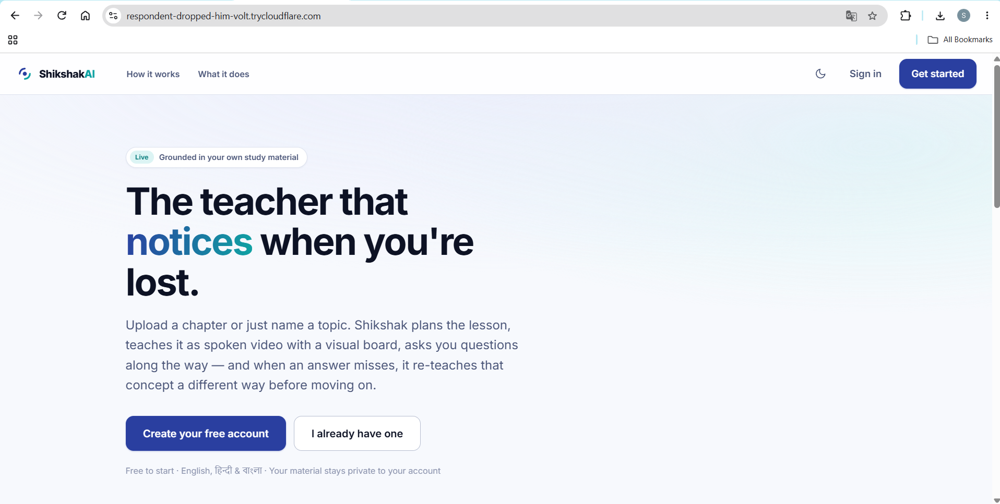
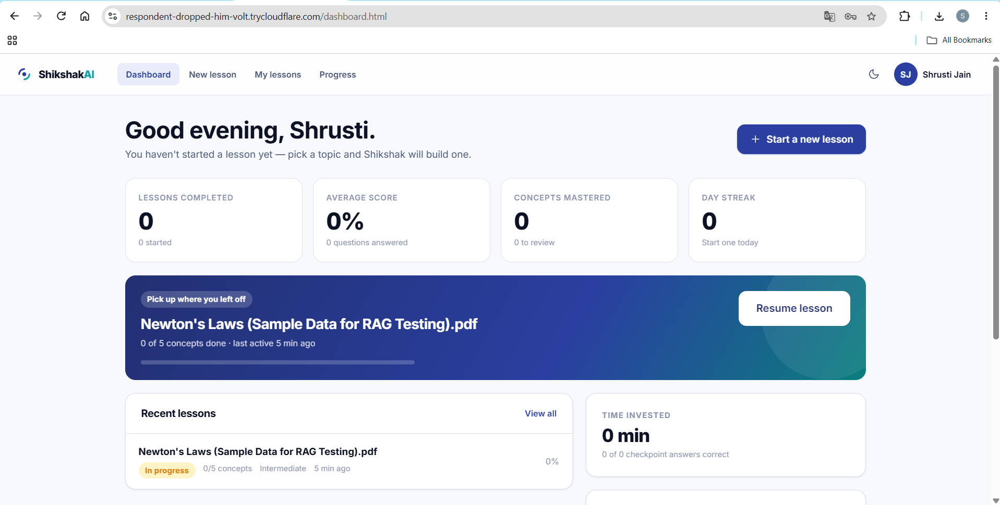
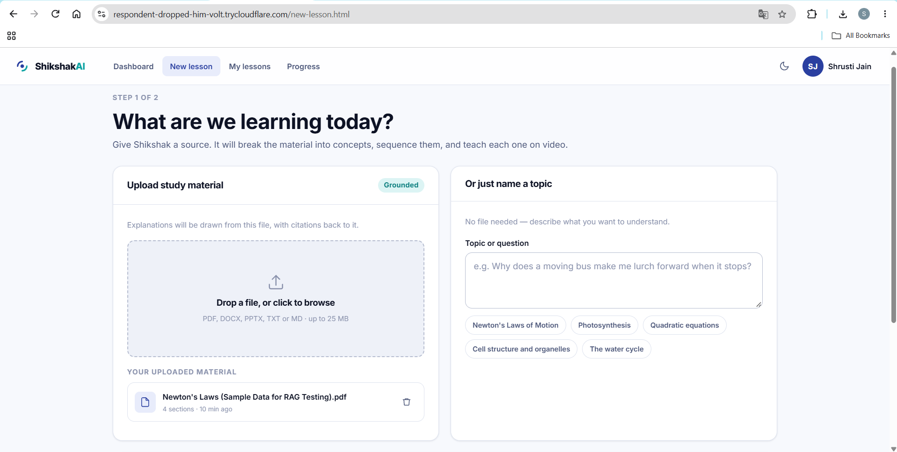
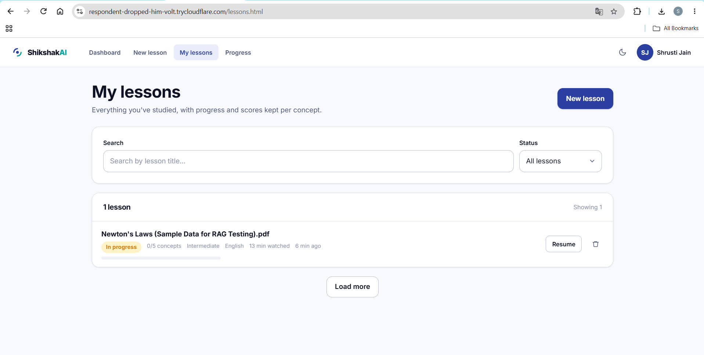
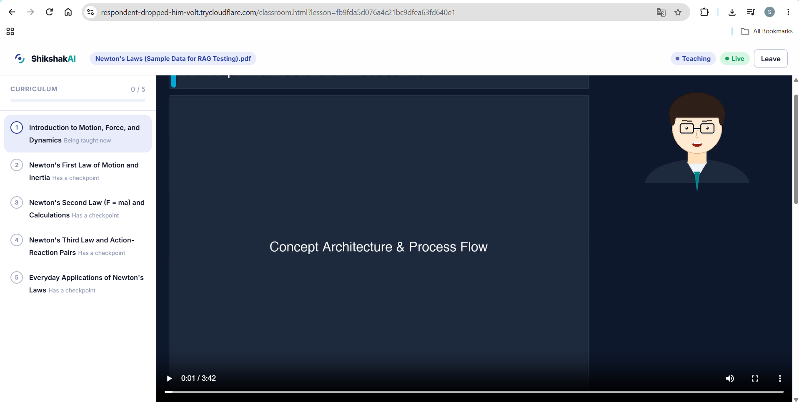
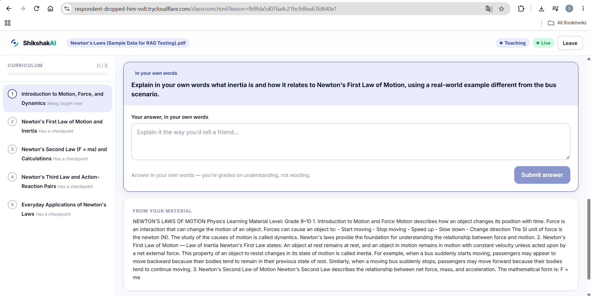
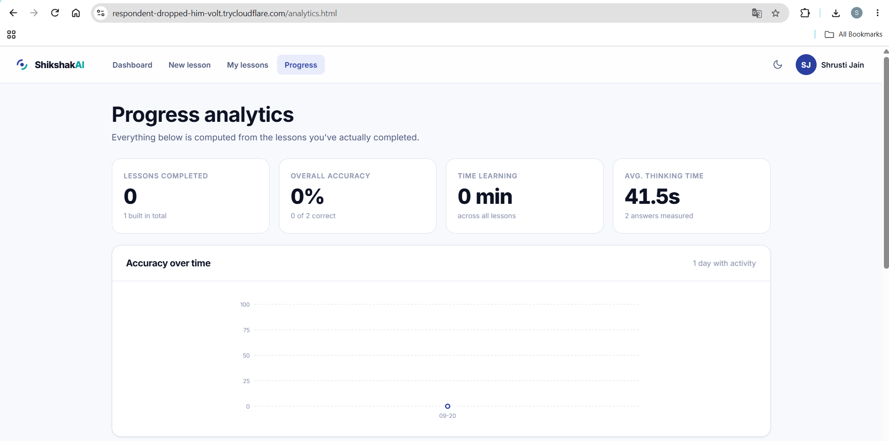

<div align="center">

# Shikshak AI (शिक्षक AI)

</div>

**Autonomous, Multimodal AI Educator with Real-Time Pedagogical Adaptation & Viseme Lip-Synced Video Instruction**

[](https://www.python.org/)
[](https://fastapi.tiangolo.com/)
[](https://sqlite.org/wal.html)
[](https://huggingface.co/BAAI/bge-m3)
[](https://deepmind.google/technologies/gemini/)
[](https://shikshak-ai.onrender.com/)

**Morrow 1.0 Hackathon** · *AI Teacher Track*

Shikshak AI is a fully functional, autonomous AI educator designed to transform unstructured educational materials (textbooks, lecture notes) into interactive, conversational, and multimodal video lessons. It replaces passive reading with an active, adaptive teaching cycle powered by an orchestrated multi-agent system, hybrid RAG grounding, and dynamic rubric-based evaluations.

---

## Problem Statement

Conventional AI learning tools treat education as static information retrieval—acting as passive chatbots waiting for student prompts and delivering one-size-fits-all walls of text. Conversely, human tutoring is highly effective and adaptive but difficult to scale. 

There is a critical need for an automated system that bridges this gap: an educator that proactively plans pedagogical curricula, explains concepts via multimodal formats, interactively questions the student, and dynamically adapts its teaching strategy based on real-time diagnostic evaluation of the student's misconceptions.

---

## Key Features

- **7-State Pedagogical FSM:** Drives the core teaching loop (`UNDERSTAND` → `PLAN` → `EXPLAIN` → `DEMONSTRATE` → `QUESTION` → `EVALUATE` → `ADAPT` → `CONTINUE`).
- **Adaptive Remediation:** Branches learning paths conditionally based on evaluation results (`ALLOW`, `MODIFY`, `REGENERATE`, or `HUMAN` escalation).
- **RAG-Grounded Orchestration:** Leverages BGE-M3 hybrid retrieval with cross-encoder reranking to accurately ground the specialized AI agents (Planner, Explainer, Questioner, Assessor) on source materials.
- **Dynamic Rubric Grading:** Evaluates free-form student responses using an ML Core against multi-criterion rubrics, identifying specific misconceptions rather than relying on strict string matching.
- **Multimodal Video Instruction:** Synthesizes real-time teaching content combining generated speech (Edge-TTS), 24 FPS facial visemes, and rendered visual boards (LaTeX, Pygments, Matplotlib) via FFmpeg.
- **Durable Session Persistence:** Utilizes SQLite WAL storage to persist the exact FSM state, allowing students to seamlessly resume interrupted lessons.
- **Robust Authentication & Security:** Implements stateless JWT access tokens, rotating HTTP-only refresh tokens, bcrypt password hashing, explicit rate limiting, and OTP email verification.

---

## Tech Stack

### Core Technologies

| Domain | Technologies |
| :--- | :--- |
| **Frontend** | Vanilla HTML5, CSS3, JavaScript (SPA with 15 screens) |
| **Backend** | FastAPI, Python 3.10+, WebSockets, Pydantic |
| **Database** | SQLite (WAL Mode), SQLAlchemy ORM |
| **AI / Agents** | Google Gemini (1.5 / 2.0), Custom Agentic Orchestration |
| **RAG** | ChromaDB, BGE-M3 (Hybrid Dense/Sparse Retrieval) |
| **ML / NLP** | Semantic Rubric Evaluator, Misconception Taxonomy |
| **Media / Video** | FFmpeg, Edge-TTS, Renderers (LaTeX, Matplotlib, Graphviz) |
| **Security** | JWT, Bcrypt, Rotating Refresh Tokens, OTP Verification |

### System Architecture

**Full End-to-End System:**

*Mapping the Vanilla JS frontend, FastAPI backend, SQLite persistence, and core Multimodal AI engine.*

**Internal AI Agents & Subsystems:**

*Demonstrating the interaction between Orchestrator Agents, the ML Core, and the RAG engine.*

---

## How to Run / Use the Project

### User Journey (How to Use)
1. **Context Initialization:** The student provides a learning topic or uploads a document, setting personal preferences (time budget, language, visual style).
2. **Curriculum Planning:** The AI Planner processes the input and generates a structured, step-by-step lesson plan.
3. **Interactive Instruction:** The Explainer drafts educational scripts, and the Media Engine generates viseme-synced video boards. 
4. **Checkpoint Evaluation:** The student answers interactive questions mid-lesson.
5. **Real-Time Adaptation:** The ML Core grades the answer, and the Adaptation Controller decides whether to proceed, re-explain, or restructure the lesson.
6. **Diagnostic Assessment:** Post-lesson, the Assessor generates a diagnostic report detailing strengths and conceptual gaps.

### Local Installation & Setup

**Prerequisites:** Python 3.10+, Git, FFmpeg (added to system `PATH`).

1. **Clone the repository:**
   ```bash
   git clone https://github.com/Sagnik120/Shikshak_AI.git
   cd Shikshak_AI
   ```

2. **Environment configuration:**
   Create and activate a virtual environment, then install dependencies:
   ```bash
   python -m venv .venv
   
   # macOS/Linux: source .venv/bin/activate
   # Windows: .\.venv\Scripts\Activate.ps1
   
   pip install --upgrade pip
   pip install -r requirements.txt
   ```

3. **Configure environment variables:**
   Copy the example environment file:
   ```bash
   # macOS/Linux: cp .env.example .env
   # Windows: Copy-Item .env.example .env
   ```
   *Note: Populate `.env` with a valid `GEMINI_API_KEY`. If `SMTP` credentials are left blank, OTP codes for authentication will be exposed directly in API responses (`dev_otp`) for testing.*

4. **Start the application:**
   The backend API and static frontend are served concurrently on a single port.
   ```bash
   python scripts/run_server.py
   ```
   *Access the platform by navigating to **http://localhost:8000** in your browser.*

---

## Team Members

- **Sagnik Chandra**
- **Shrusti Jain**

---

## Screenshots / Demo

### Demo Materials
**[Access the Demo Video and Materials via Google Drive](https://drive.google.com/drive/folders/1ibsr1tZanhtruCBbIwiGkAy0mXx35XLY?usp=drive_link)**

### Application Interfaces

**1. Landing & Home Page**  


**2. Learner Dashboard**  


**3. Lesson Creation & Setup**  


**4. Lesson Progress**  


**5. Active Classroom & Study Mode**  
  


**6. Analytics & Progress**  

