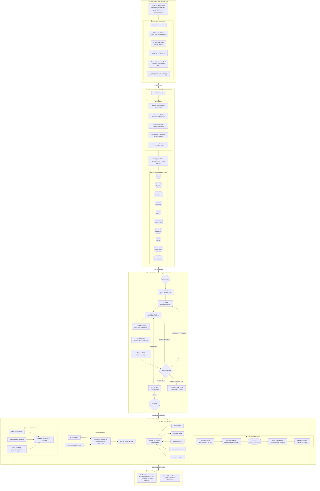

# Shikshak AI — Full System Architecture Diagram Prompt & Blueprint

> **Purpose**: This document provides an exhaustive, production-grade architectural specification and prompt designed to be copied directly into AI diagramming tools (such as **Eraser.io**, **Mermaid.js**, **PlantUML**, **Draw.io**, or **Lucidchart**) to generate an end-to-end visual architecture of the **Shikshak AI** platform.

---

## 1. AI Diagram Generator Prompt (Copy & Paste Ready)

```text
Generate a comprehensive, professional, multi-tier system architecture diagram for "Shikshak AI", an autonomous multimodal AI educator platform.

The diagram must clearly display the following 6 interconnected zones:

1. FRONTEND USER INTERFACE & AUTHENTICATION FLOW:
   - Pages: Landing, Signup with OTP Verification, Login, Password Reset, Dashboard (Analytics & Streak Plots), Lesson Builder (Topic string or PDF/DOCX/PPTX upload), Live Classroom (Video, Subtitles, Viseme Lip-Sync, Visual Board, AI Inspector Panel, Notes), History, Lesson Report, Account Settings.
   - Security Primitives: Bcrypt password hashing, JWT Access Tokens (short-lived with token_version claim), HTTP-only Rotating Refresh Tokens in SQLite DB, Email OTP with dev file transport fallback, Rate Limiting (SlowAPI / IP bucket), explicit CORS origin whitelist, Trusted Proxy Header validation (X-Forwarded-For), Filesystem Path Traversal Protection on Media Endpoints.

2. LEARNER CAPABILITIES & ANTI-CHEATING/ENGAGEMENT ENFORCEMENT:
   - Anti-Cheating: Dynamic question variation generator, free-form rubric evaluation (prevents exact textbook copy-pasting), strict non-skippable concept sequence.
   - Active Session Persistence: SQLite WAL session state engine (allows tab close/refresh recovery mid-lesson).
   - Engagement Analytics: Streak calculation engine, rolling concept mastery profile, misconception frequency tracking, time budget node allocation.

3. FASTAPI BACKEND & DATABASE ENGINE:
   - FastAPI Application & APIRouters: Auth Router (/api/auth), Account Router (/api/account), Lesson Router (/api/lessons), Dashboard Router (/api/dashboard), Live Classroom WebSocket (/ws/classroom).
   - SessionManager & Container: Dependency injection container, WebSocket ticket authentication, bidirectional event stream dispatcher.
   - SQLite Database (WAL Mode): 10 core tables (users, otp_codes, refresh_tokens, documents, lessons, lesson_nodes, interactions, reports, lesson_events, learner_profiles).

4. SHIKSHAK AI 7-STATE TEACHING FSM & ADAPTATION CONTROLLER:
   - States: UNDERSTAND -> PLAN -> EXPLAIN -> DEMONSTRATE -> QUESTION -> EVALUATE -> ADAPT -> CONTINUE -> DONE.
   - Adaptation Decision Tree:
     * ALLOW (Passes checkpoint -> advance to next concept node)
     * MODIFY (Near miss / minor gap -> re-teach concept with alternative analogy and rendered board)
     * REGENERATE (Multiple consecutive failures -> re-plan remaining curriculum concepts)
     * HUMAN (Persistent failure -> pause auto-teach & trigger human tutor escalation ticket)

5. CORE AI/ML PIPELINE MODULES:
   - RAG Engine: PDF/DOCX/PPTX Document Parser, BGE-M3 Hybrid Embedder (Dense vectors + Sparse SPLADE), Chroma Vector DB, Reciprocal Rank Fusion (RRF) Retriever, Cross-Encoder Reranker, Query Preprocessor & 5-min TTL Retrieval Cache.
   - AI Agent Orchestration: Gemini 1.5/2.0 LLM & Offline Fallback Adapters, Curriculum Planner Agent, Explainer Agent, Questioner Agent, Adaptation Controller, Assessment Summary Agent.
   - ML Core: MCQ Evaluator, Freeform Rubric Evaluator, Misconception Taxonomy Engine (Physics, Math, Biology rulesets), Learner Mastery Engine.
   - Avatar & Voice Engine: Edge-TTS Adapter, Viseme/WebVTT Lip-Sync Aligner, Visual Renderers (LaTeX Equations, Matplotlib 2D Graphs, Graphviz Flowcharts, Pygments Code Boards, Bullet Takeaways), FFmpeg 1080p 24FPS Compositor.

6. MLOPS & DOCKER DEPLOYMENT:
   - PerfTrace Instrumentation: E2E Latency profiling across parsing, embedding, LLM calls, TTS synthesis, visual rendering, and video composition.
   - Docker Containerization: Single-command deployment via Docker & Docker Compose (`docker-compose.yml`).

Use modern pastel/dark colors, distinct service boxes, directional data flow arrows with exact protocol labels (HTTPS, WSS, IPC, SQL), and clear zone boundaries.
```

---

## 2. Complete End-to-End System Architecture (Mermaid.js Code)



---

## 3. Detailed Data Flow & Anti-Cheating Sequence Prompt

```text
Generate a Sequence Diagram for "Shikshak AI Interactive Learning Session with Anti-Cheating & Adaptation":

Participants:
1. Student (Browser SPA)
2. FastAPI Gateway (Backend Router)
3. SQLite DB (WAL Persistence)
4. RAG Service (BGE-M3 + ChromaDB)
5. AI Orchestrator (7-State FSM)
6. ML Core (Rubric & Misconception Evaluator)
7. Avatar & Voice (TTS + Renderers + FFmpeg)

Steps:
1. Student submits document/topic to Backend -> Backend authenticates JWT, verifies rate limits, and saves document record to SQLite `documents`.
2. Backend calls RAG Service -> Document Parser extracts text, BGE-M3 generates Dense+Sparse vectors, stores in ChromaDB.
3. Student connects to WebSocket `/ws/classroom` with single-use ticket -> SessionManager verifies ticket, loads/rebuilds SessionState from SQLite `lessons` and `lesson_nodes`.
4. Orchestrator enters `PLAN` state -> Planner Agent generates concept tree.
5. For each concept node (e.g., `EXPLAIN` state):
   a. Explainer Agent calls RAG Hybrid Retriever for grounded context.
   b. Explainer Agent generates script & visual board specification (`EQUATION`/`GRAPH`/`DIAGRAM`/`CODE`).
   c. Avatar & Voice synthesizes Edge-TTS audio, extracts visemes, converts SRT to WebVTT, renders visual board image, composites 1080p video with FFmpeg.
   d. Backend streams `teaching_segment` payload over WebSocket to Student.
6. Checkpoint Question (`QUESTION` state):
   a. Questioner Agent generates a dynamic rubric question (prevents exact textbook copy-pasting).
   b. Student submits answer -> Backend receives `student_response`.
7. Evaluation & Adaptation (`EVALUATE` & `ADAPT` states):
   a. ML Core evaluates response against rubric; Misconception Detector checks taxonomy (`physics.json`, etc.).
   b. Adaptation Controller computes consecutive node failures.
   c. If Correct -> Decision `ALLOW` -> Save interaction to SQLite `interactions` -> Advance concept.
   d. If Near Miss -> Decision `MODIFY` -> Re-teach concept with alternative analogy.
   e. If Multiple Failures -> Decision `REGENERATE` -> Re-plan remaining concept tree.
   f. If Persistent Failure -> Decision `HUMAN` -> Escalate to human tutor ticket & pause auto-teach.
8. Lesson Completion (`DONE` state):
   a. Assessment Agent generates final score, strong/weak topics, narrative report -> Saves to SQLite `reports`.
   b. Learner Profile Engine updates rolling mastery streak & concept mastery scores in SQLite `learner_profiles`.
```

---

## 4. Key Architectural Features & Specifications

| Dimension | Specification & Implementation |
| :--- | :--- |
| **Authentication & Auth Security** | Bcrypt password hashing, JWT Access Tokens (`token_version` claim), HTTP-only Rotating Refresh Tokens in SQLite `refresh_tokens`, Email OTP via SMTP with local dev file transport fallback (`data/outbox/`). |
| **API & Data Security** | SlowAPI rate limiting, trusted proxy IP header validation (`TRUST_PROXY_HEADERS`), explicit CORS origin whitelist, Strict media endpoint path traversal containment check (`/api/media/{lesson_id}/{node_id}`). |
| **State Machine Engine** | Explicit 7-State FSM (`UNDERSTAND`, `PLAN`, `EXPLAIN`, `DEMONSTRATE`, `QUESTION`, `EVALUATE`, `ADAPT`, `CONTINUE`, `DONE`). |
| **Adaptation Logic** | 4-branch Adaptation Engine: `ALLOW` (Pass), `MODIFY` (Re-teach visual/analogy), `REGENERATE` (Re-plan curriculum), `HUMAN` (Escalate to human tutor ticket). |
| **Anti-Cheating & Engagement** | Dynamic non-repeating rubric questions, free-form answer evaluation, non-skippable concept sequence, SQLite WAL session state persistence for seamless mid-lesson resume on refresh. |
| **Analytics & Mastery** | Rolling streak calculation, exponential moving average concept mastery scores, misconception frequency distribution breakdown, downloadable PDF reports. |
| **Database Architecture** | SQLite in WAL (Write-Ahead Logging) mode with 10 tables (`users`, `otp_codes`, `refresh_tokens`, `documents`, `lessons`, `lesson_nodes`, `interactions`, `reports`, `lesson_events`, `learner_profiles`). |
| **Multimodal Media Engine** | Edge-TTS neural voice synthesis, viseme lip-sync alignment, WebVTT subtitle generation, Matplotlib/LaTeX/Graphviz/Pygments visual renderers, FFmpeg 1080p 24FPS compositor. |
| **RAG Grounding Engine** | Document parsing (PDF/DOCX/PPTX/Text), BGE-M3 Dense+Sparse SPLADE embedding, ChromaDB vector store, Reciprocal Rank Fusion (RRF) retrieval, Cross-Encoder reranking, 5-min TTL retrieval cache. |
| **Deployment & MLOps** | Docker & Docker Compose single-command launch (`docker-compose.yml`), `PerfTrace` end-to-end latency profiling across all pipeline stages. |
