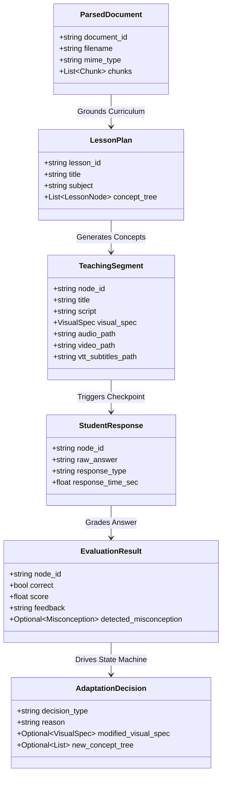

# Shikshak AI — Internal AI Agents & Subsystems Architecture Diagram Prompt & Blueprint

> **Purpose**: This document provides an exhaustive, granular architectural prompt and technical spec detailing the internal mechanics, component connections, data payload schemas, and agent interaction flows across all 6 modules of **Shikshak AI** (`ai_agent_orchestration`, `avatar_voice`, `backend`, `frontend`, `ml_core`, `mlops`, and `rag`). Use this prompt to generate high-resolution internal subsystem diagrams in **Eraser.io**, **Mermaid.js**, **PlantUML**, **Draw.io**, or **Lucidchart**.

---

## 1. AI Diagram Generator Prompt (Copy & Paste Ready)

```text
Generate an intricate, highly detailed software component and agent interaction diagram for the internal AI subsystems of "Shikshak AI".

The diagram must visualize the granular micro-architecture across the following 6 core modules and their exact sub-components:

1. `ai_agent_orchestration` MODULE:
   - OrchestratorFSM: 7-state finite state machine engine (`UNDERSTAND`, `PLAN`, `EXPLAIN`, `DEMONSTRATE`, `QUESTION`, `EVALUATE`, `ADAPT`, `CONTINUE`, `DONE`).
   - SessionState: Tracks active `node_id`, concept node tree, mastery list, history tail, and session metadata.
   - Planner Agent: Prompts LLM to break down document/topic into sequenced concept nodes (`intro` -> `core` -> `advanced`) with time budget allocations.
   - Explainer Agent: Generates narrative script, analogy selection, and visual board specification (`EQUATION`, `GRAPH`, `DIAGRAM`, `CODE`, `TAKEAWAY`).
   - Questioner Agent: Generates target questions tied to node learning objectives and rubric criteria.
   - Adaptation Controller: Computes consecutive failures from session history tail and evaluates 4-branch decision tree (`ALLOW`, `MODIFY`, `REGENERATE`, `HUMAN`).
   - Assessment Agent: Generates overall lesson score, strong/weak concept lists, and narrative learning report.
   - LLM Adapters: `GeminiAdapter` (live API integration) and `OfflineFallbackAdapter` (deterministic offline fallback).

2. `rag` GROUNDING MODULE:
   - DocumentParser: Extracts structured text and metadata from PDF (PyPDF/Tesseract OCR), DOCX (python-docx), PPTX (python-pptx), and plain text.
   - Semantic Chunker: Sliding window chunker tagging section headers, page numbers, and chunk indices.
   - BGE-M3 Embedding Adapter: Synthesizes 1024-dim Dense vector embeddings + Sparse SPLADE lexical keyword weights.
   - ChromaVectorStoreAdapter: Manages Chroma vector collections and distance metric indexing.
   - HybridRetriever: Reciprocal Rank Fusion (RRF) combining dense and sparse scores, followed by Cross-Encoder reranking.
   - QueryPreprocessor & _RetrievalCache: Normalizes query strings and manages thread-safe 5-minute TTL retrieval result cache.
   - Grounding Context Builder: Formats retrieved context blocks according to Contract.md §4 strict context injection rules.

3. `ml_core` EVALUATION & TAXONOMY MODULE:
   - MCQ Evaluator: Validates selected option against answer key and extracts distractor rationale.
   - Freeform Rubric Evaluator: Evaluates free-text student answer against multi-point rubric, reconciles LLM credit allocation with correctness boolean.
   - Misconception Detector: Matches student responses against domain taxonomy files (`physics.json`, `math.json`, `biology.json`) using semantic similarity and keyword rulesets.
   - Learner Profile Engine: Calculates exponential moving average mastery scores and updates learner profile state.

4. `avatar_voice` MEDIA GENERATION MODULE:
   - EdgeTTSAdapter: Asynchronous neural text-to-speech synthesis generating MP3 audio and Viseme event streams.
   - Subtitle Aligner: Converts raw TTS word/sentence boundaries into clean WebVTT subtitle files (`.vtt`).
   - Board Visual Renderers:
     * EquationRenderer: LaTeX formula rendering to transparent PNG via Matplotlib.
     * GraphRenderer: 2D function/data plotting to PNG via Matplotlib.
     * DiagramRenderer: Flowchart and graph diagram rendering via Graphviz.
     * CodeRenderer: Pygments syntax-highlighted code board rendering.
     * TakeawayRenderer: Key summary bullet-point board rendering.
   - Video Compositor: FFmpeg multi-stream composition blending 1080p 24FPS visual board background, PiP avatar overlay, audio track, and WebVTT subtitles.

5. `backend` & DATA PERSISTENCE MODULE:
   - FastAPI Application: Routers for `/api/auth`, `/api/account`, `/api/lessons`, `/api/dashboard`, `/api/media`.
   - WebSocket SessionManager: Ticket validation, active WebSocket registry, event loop integration.
   - Database Models (SQLAlchemy / SQLite WAL): `users`, `otp_codes`, `refresh_tokens`, `documents`, `lessons`, `lesson_nodes`, `interactions`, `reports`, `lesson_events`, `learner_profiles`.
   - Security Primitives: Bcrypt hashing, JWT validation, rate limiting, media endpoint isolation.

6. `mlops` TELEMETRY MODULE:
   - PerfTrace Instrumentor: `begin_trace()`, `end_trace()`, `TimedBlock` tracking execution latency for Parsing, Embedding, RAG Retrieval, LLM Generation, TTS Synthesis, Visual Rendering, and FFmpeg Video Composition.

Connect all modules using explicit data payloads (`LessonPlan`, `TeachingSegment`, `StudentResponse`, `EvaluationResult`, `AdaptationDecision`, `LearnerReport`). Use distinct color themes per module and clear directional flow lines.
```

---

## 2. Granular Internal Subsystems Architecture (Mermaid.js Code)

```mermaid
flowchart TB
    %% ==========================================
    %% MODULE 1: FASTAPI BACKEND & PERSISTENCE
    %% ==========================================
    subgraph MOD_BACKEND ["⚡ Module: backend"]
        direction TB
        FASTAPI["FastAPI Gateway"]
        WS_MGR["WebSocket SessionManager<br/>(Ticket Auth & WS Registry)"]
        
        subgraph ROUTERS ["API Endpoints"]
            AUTH_EP["/api/auth"]
            ACCT_EP["/api/account"]
            LESSON_EP["/api/lessons"]
            DASH_EP["/api/dashboard"]
            MEDIA_EP["/api/media/{lesson_id}/{node_id}"]
        end
        
        subgraph DB_MODELS ["SQLAlchemy Models (SQLite WAL)"]
            M_USER["User"]
            M_LESSON["Lesson"]
            M_NODE["LessonNode"]
            M_INTERACTION["Interaction"]
            M_REPORT["Report"]
            M_PROFILE["LearnerProfile"]
        end
        
        FASTAPI --> ROUTERS
        ROUTERS --> WS_MGR
        WS_MGR --> DB_MODELS
    end

    %% ==========================================
    %% MODULE 2: RAG GROUNDING ENGINE
    %% ==========================================
    subgraph MOD_RAG ["📚 Module: rag"]
        direction TB
        DOC_PARSER["DocumentParser<br/>(PDF / DOCX / PPTX / Text)"]
        CHUNK_ENG["Semantic Chunker<br/>(Sliding Window + Metadata)"]
        BGE_EMBED["BGE-M3 Embedder<br/>(Dense 1024d + Sparse SPLADE)"]
        CHROMA_STORE[("Chroma Vector Store")]
        HYBRID_RET["Hybrid RRF Retriever<br/>+ Cross-Encoder Reranker"]
        PREPROC_CACHE["Query Preprocessor<br/>+ 5-min TTL Cache"]
        GROUND_BUILD["Grounding Context Builder<br/>(Contract.md §4 Format)"]
        
        DOC_PARSER --> CHUNK_ENG --> BGE_EMBED --> CHROMA_STORE
        CHROMA_STORE --> HYBRID_RET --> PREPROC_CACHE --> GROUND_BUILD
    end

    %% ==========================================
    %% MODULE 3: AI AGENT ORCHESTRATION
    %% ==========================================
    subgraph MOD_ORCH ["🤖 Module: ai_agent_orchestration"]
        direction TB
        ORCH_FSM["OrchestratorFSM<br/>(7 States Execution Loop)"]
        SESS_STATE["SessionState<br/>(Node Tree & History Tail)"]
        
        subgraph AGENTS ["AI Sub-Agents"]
            AG_PLAN["Planner Agent<br/>(Curriculum Breakdown)"]
            AG_EXPLAIN["Explainer Agent<br/>(Script & Visual Spec)"]
            AG_QUEST["Questioner Agent<br/>(Rubric Question Gen)"]
            AG_ADAPT["Adaptation Controller<br/>(ALLOW / MODIFY / REGENERATE / HUMAN)"]
            AG_ASSESS["Assessment Agent<br/>(Summary Report Gen)"]
        end
        
        LLM_FACADE{"LLM Adapter Facade"}
        GEMINI_ADAPT["Gemini LLM Adapter"]
        OFFLINE_ADAPT["Offline Fallback Adapter"]
        
        ORCH_FSM <--> SESS_STATE
        ORCH_FSM --> AGENTS
        AGENTS <--> LLM_FACADE
        LLM_FACADE --> GEMINI_ADAPT & OFFLINE_ADAPT
    end

    %% ==========================================
    %% MODULE 4: ML CORE EVALUATION & TAXONOMY
    %% ==========================================
    subgraph MOD_ML ["🔬 Module: ml_core"]
        direction TB
        MCQ_VAL["MCQ Evaluator"]
        FREE_VAL["Freeform Rubric Evaluator<br/>(Credit Reconciliation)"]
        
        subgraph TAXONOMY ["Misconception Taxonomy Engine"]
            TAX_PHYS["physics.json"]
            TAX_MATH["math.json"]
            TAX_BIO["biology.json"]
            MISC_MATCH["Semantic Misconception Matcher"]
            
            TAX_PHYS & TAX_MATH & TAX_BIO --> MISC_MATCH
        end
        
        MASTERY_CALC["Learner Mastery Engine<br/>(Exponential Moving Average)"]
        
        MCQ_VAL & FREE_VAL --> MISC_MATCH --> MASTERY_CALC
    end

    %% ==========================================
    %% MODULE 5: AVATAR & VOICE COMPOSITOR
    %% ==========================================
    subgraph MOD_AVATAR ["🎬 Module: avatar_voice"]
        direction TB
        TTS_ADAPT["EdgeTTSAdapter<br/>(Neural Audio Synthesis)"]
        VISEME_ALIGN["Viseme & WebVTT Aligner"]
        
        subgraph VIS_RENDER ["Visual Board Renderers"]
            R_EQ["EquationRenderer (LaTeX)"]
            R_GRAPH["GraphRenderer (Matplotlib 2D)"]
            R_DIAG["DiagramRenderer (Graphviz)"]
            R_CODE["CodeRenderer (Pygments)"]
            R_BULLET["TakeawayRenderer (Summary)"]
        end
        
        FFMPEG_COMP["FFmpeg Video Compositor<br/>(1080p 24FPS Multi-Stream)"]
        
        TTS_ADAPT --> VISEME_ALIGN
        VISEME_ALIGN & VIS_RENDER --> FFMPEG_COMP
    end

    %% ==========================================
    %% MODULE 6: MLOPS TELEMETRY
    %% ==========================================
    subgraph MOD_MLOPS ["📦 Module: mlops"]
        direction TB
        PERF_TRACE["PerfTrace Instrumentor<br/>(Latency Tracing & TimedBlock)"]
        METRICS_LOG["Telemetry & Benchmark Logger"]
        
        PERF_TRACE --> METRICS_LOG
    end

    %% ==========================================
    %% INTER-MODULE PAYLOAD FLOWS
    %% ==========================================
    MOD_BACKEND -- "WebSocket Events & Tickets" --> MOD_ORCH
    MOD_RAG -- "Grounded Context Blocks" --> MOD_ORCH
    MOD_ORCH -- "TeachingSegment & Specs" --> MOD_AVATAR
    MOD_ORCH -- "Student Answers & Context" --> MOD_ML
    MOD_ML -- "EvaluationResult & Misconception" --> MOD_ORCH
    MOD_AVATAR -- "Rendered 1080p Media Paths" --> MOD_BACKEND
    MOD_ORCH & MOD_RAG & MOD_AVATAR & MOD_ML -. "Latency Events" .-> MOD_MLOPS
```



---

## 3. Data Payload Schemas & Data Contract Interactions

The subsystems exchange strictly typed data contracts as defined in `instructions/Contract.md`:



---

## 4. Deep-Dive Agent Workflows & Decision Matrices

### 4.1 Planner Agent Workflow
1. Receives document summary from `rag` or user topic string.
2. Evaluates time budget (e.g., 5, 10, or 20 minutes).
3. Constructs node sequence: `intro` -> `core_1` -> `core_2` -> `advanced`.
4. Outputs `LessonPlan` JSON matching Contract.md §3 schema.

### 4.2 Explainer Agent & Board Selector
1. Reads current concept node objectives.
2. Queries `rag.HybridRetriever` for top-k grounded passages.
3. Selects visual format based on concept type:
   - Mathematical formula -> `EQUATION` (LaTeX via Matplotlib)
   - Function / Data trend -> `GRAPH` (Matplotlib 2D plot)
   - Process / Hierarchy -> `DIAGRAM` (Graphviz flowchart)
   - Programming concept -> `CODE` (Pygments code board)
   - Conceptual summary -> `TAKEAWAY` (Bullet summary board)

### 4.3 Adaptation Controller Matrix

```text
+-----------------------------------------------------------------------------------+
|                            ADAPTATION DECISION MATRIX                            |
+-------------------+--------------------+--------------------+---------------------+
| Condition         | Evaluation Outcome | Consecutive Fails  | Decision Output     |
+-------------------+--------------------+--------------------+---------------------+
| Score >= 0.75     | Pass               | 0                  | ALLOW (Next Node)   |
| 0.40 <= Score <75 | Near Miss          | 1                  | MODIFY (Re-teach)   |
| Score < 0.40      | Fail               | 2                  | REGENERATE (Replan) |
| Persistent Fail   | Fail               | >= 3               | HUMAN (Escalate)    |
+-------------------+--------------------+--------------------+---------------------+
```

---

## 5. Summary Table of Subsystem Responsibilities

| Module | Core Classes / Files | Primary Responsibility | Output Artifact |
| :--- | :--- | :--- | :--- |
| `ai_agent_orchestration` | `OrchestratorFSM`, `PlannerAgent`, `ExplainerAgent`, `QuestionerAgent`, `AdaptationController`, `AssessmentAgent` | FSM State transition, curriculum planning, script generation, adaptation logic | `LessonPlan`, `TeachingSegment`, `AdaptationDecision` |
| `rag` | `DocumentParser`, `BGE-M3 Embedder`, `ChromaVectorStoreAdapter`, `HybridRetriever`, `QueryPreprocessor` | Document ingestion, hybrid dense+sparse retrieval, reranking, grounding context | `ParsedDocument`, `RetrievalResult` |
| `ml_core` | `MCQEvaluator`, `FreeformEvaluator`, `MisconceptionDetector`, `LearnerProfileEngine` | Answer grading against rubrics, misconception taxonomy mapping, rolling mastery updates | `EvaluationResult`, `Misconception`, `LearnerProfile` |
| `avatar_voice` | `EdgeTTSAdapter`, `EquationRenderer`, `GraphRenderer`, `DiagramRenderer`, `CodeRenderer`, `VideoCompositor` | Neural voice synthesis, viseme lip-sync, LaTeX/Matplotlib/Graphviz board rendering, 1080p FFmpeg video composition | `.mp3` Audio, `.vtt` Subtitles, `.png` Boards, `.mp4` Video |
| `backend` | FastAPI App, `SessionManager`, Auth Routers, SQLAlchemy SQLite DB Models | API routing, WebSocket session management, security middlewares, persistence of 10 tables | JSON REST Responses, WSS Frames, SQLite DB |
| `mlops` | `PerfTrace`, `TimedBlock`, Telemetry Loggers | Pipeline execution latency profiling, performance metrics collection | Latency Logs, Benchmark Reports |
